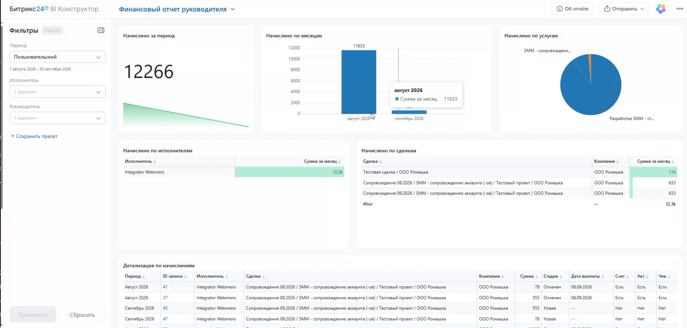

# Финансовый учёт в Битрикс24 для руководителя проекта

Давайте разберём, как начислить исполнителям оплату за работу, согласовать суммы, передать документы в бухгалтерию и проверить, что после выплаты получены чеки.

Мы работаем с двумя видами карточек:

- **Начисления по проектам** — сколько начислили конкретному исполнителю за услугу в сделке.
- **Расчёты с исполнителями** — какие начисления оплачиваем вместе. В этой карточке собираются сумма, счёт, акт, дата выплаты и чек.

Для **сопровождения** все начисления одного исполнителя за один расчётный месяц собираются в общий расчёт, даже если он работает над несколькими проектами. Для **разовых работ** каждое начисление создаёт отдельный расчёт. Его можно согласовать и оплатить независимо от сопровождения.

Например, две услуги по сопровождению за сентябрь попадут в одну карточку расчёта исполнителя. Две разовые работы за тот же месяц — в две отдельные карточки.

## Создаём начисления в сделке

Начнём со сделки, чтобы каждое начисление было связано с нужным проектом.

**Шаг 1.** Открываем **CRM** и нужную сделку в направлении **«Работы»** или **«Сопровождение»**.

**Шаг 2.** Переходим на вкладку **«Начисления по проектам»** и нажимаем **«Новый элемент»**.

> 📷 **Место для скриншота 1.**
> **Подпись:** Начисления создаём прямо из сделки на вкладке «Начисления по проектам».
> **Для автора:** вставить скриншот открытой сделки. Показать название сделки, вкладку «Начисления по проектам» и кнопку «Новый элемент».

**Шаг 3.** Заполняем карточку.

| Поле | Что указываем |
| --- | --- |
| Исполнитель | Кто выполнил работу |
| Услуга | За какую услугу начисляем оплату |
| Сумма начисления | Сколько начисляем исполнителю за эту услугу |
| Тип начисления | «Сопровождение» или «Разовые работы» |
| Расчётный месяц | За какой месяц начисляем оплату |
| Расчётный год | К какому году относится этот месяц |

Тип начисления выбираем вручную, даже если открыли карточку из направления «Сопровождение». При создании нового начисления месяц и год тоже указываем сами.

> 💡 Расчётный месяц — это месяц работы. Если начисляем за сентябрь, а платим в октябре, в начислении выбираем **сентябрь**.

> 📷 **Место для скриншота 2.**
> **Подпись:** В начислении указываем исполнителя, услугу, сумму, тип и расчётный период.
> **Для автора:** вставить заполненную форму нового начисления до сохранения. Все шесть полей из таблицы должны быть видны. Использовать тестовый пример с типом «Сопровождение».

**Шаг 4.** Нажимаем **«Сохранить»**. Система сама создаст расчёт исполнителя или добавит начисление в его существующий расчёт по сопровождению за этот месяц.

**Шаг 5.** Если в сделке несколько исполнителей или один исполнитель оказывает несколько услуг, создаём отдельное начисление для каждой услуги каждого исполнителя.

> 💡 Пустая вкладка не всегда означает, что начислений нет. Фильтр **«В работе»** скрывает завершённые записи. Нажмите крестик у фильтра, чтобы проверить историю и не создать начисление повторно.

## Проверяем начисления после продления сопровождения

При пролонгации — продлении сопровождения на следующий период — начисления копируются в новую сделку, поэтому проверим их перед следующим расчётом.

**Шаг 1.** Завершаем текущую сделку сопровождения в обычном порядке. Когда система запросит дату пролонгации, указываем её и нажимаем **«Сохранить»**.

**Шаг 2.** Открываем созданную сделку следующего периода и переходим на вкладку **«Начисления по проектам»**.

В ней появятся начисления из предыдущей сделки:

- с теми же исполнителями, услугами и суммами;
- с новым расчётным месяцем;
- на стадии **«Новая»**.

**Шаг 3.** Проверяем состав работ и суммы. Если условия изменились, открываем нужное начисление и корректируем данные до согласования. Неактуальные начисления переводим в **«Отменено»**, чтобы исключить их из суммы расчёта.

> 📷 **Место для скриншота 3.**
> **Подпись:** После пролонгации проверяем скопированные начисления за новый месяц.
> **Для автора:** вставить вкладку «Начисления по проектам» в новой сделке сопровождения. Показать исполнителей, суммы, новый расчётный месяц и стадию «Новая».

> 💡 Автоматическое копирование начислений работает при пролонгации сопровождения. При обычном копировании сделки начисления не переносятся. Если в исходной сделке их ещё не было, заполните начисления в нужной сделке вручную.

## Проверяем состав и сумму расчёта

Перед согласованием убедимся, что все работы учтены и общая сумма верна.

**Шаг 1.** В левом меню открываем **«Финансовый учёт» → «Расчёты с исполнителями»**.

**Шаг 2.** Находим нужного исполнителя и период. Проверяем тип в названии карточки: **«Сопровождение»** или **«Разовые работы»**. Пока расчёт готовится, он находится на стадии **«Формируется»**.

**Шаг 3.** Открываем расчёт и вкладку **«Начисления по проектам»**. Сверяем сделки, услуги и суммы.

- В сопровождении здесь могут быть начисления по нескольким проектам за месяц.
- В расчёте за разовую работу — одно связанное начисление.

**Шаг 4.** Чтобы увидеть актуальный итог, в карточке расчёта открываем **«Бизнес-процессы»**, выбираем процесс пересчёта общей суммы и нажимаем **«Запустить»**.

Система пересчитает сумму связанных начислений. Для сопровождения она также подтянет сумму предыдущего месяца, если соответствующий расчёт есть.

**Шаг 5.** Сравниваем текущий и предыдущий месяцы. Если сумма неожиданно отличается, проверяем:

- по всем ли нужным сделкам созданы начисления;
- все ли сделки сопровождения пролонгированы;
- не пропущена ли услуга или исполнитель;
- менялись ли объём работ и договорённая сумма.

Суммы не обязаны совпадать. Нам нужно понимать причину разницы.

> 💡 Общая сумма может обновиться не сразу после добавления начисления. Запустите пересчёт вручную перед проверкой. При переводе расчёта на согласование он также выполняется автоматически.

> 📷 **Место для скриншота 4.**
> **Подпись:** Перед согласованием пересчитываем сумму и сравниваем её с предыдущим месяцем.
> **Для автора:** вставить два кадра карточки расчёта по сопровождению: меню «Бизнес-процессы» с процессом пересчёта и результат с общей суммой и суммой предыдущего месяца.

## Отправляем расчёт исполнителю на согласование

Когда начисления проверены, отправим их исполнителю, чтобы он сверил сумму перед подготовкой документов.

**Шаг 1.** В **«Расчётах с исполнителями»** открываем нужную карточку и переводим её на стадию **«На согласовании»**.

Если нужно отправить несколько расчётов сразу, используем представление **«Список»**:

1. Отмечаем нужные записи галочками.
2. Нажимаем **«Изменить стадию»**.
3. Выбираем **«На согласовании»**.
4. Нажимаем **«Применить»**.

**Шаг 2.** Исполнитель получает задачу **«Проверить начисления за расчётный период»**. В ней он может открыть связанный расчёт и посмотреть расшифровку.

**Шаг 3.** Если исполнитель обнаружил расхождение, обсуждаем конкретное начисление. Для этого в его карточке есть кнопка **«Обсудить в чате»** — при создании обсуждения система подключает руководителя проекта. Проверяем замечание и корректируем ошибочную сумму или другие данные начисления.

Просим исполнителя завершить задачу проверки, когда сумма согласована. После завершения задачи он получит задание на загрузку счёта и акта.

> 📷 **Место для скриншота 5.**
> **Подпись:** Несколько расчётов можно отправить на согласование одним действием.
> **Для автора:** вставить список «Расчёты с исполнителями» с отмеченными записями, действием «Изменить стадию», выбранной стадией «На согласовании» и кнопкой «Применить».

> 💡 Для согласования используем **изменение стадии**. Умный сценарий **«Оплачено»** понадобится позже, когда бухгалтерия подтвердит выплату.

## Проверяем счёт и акт

Перед передачей в бухгалтерию проверим, что исполнитель загрузил документы на согласованную сумму.

**Шаг 1.** Ждём, пока исполнитель выполнит задание на загрузку счёта и акта. После сохранения документов расчёт переходит на стадию **«Передано в бухгалтерию»**.

**Шаг 2.** Открываем карточку расчёта и проверяем поля **«Счёт»** и **«Акт»**. Открываем файлы и сверяем сумму с расчётом.

- По сопровождению исполнитель загружает комплект на общую сумму за месяц.
- По разовой работе — комплект для отдельного расчёта.

**Шаг 3.** Если документы и сумма верны, передаём их бухгалтерии способом, описанным ниже. Сам переход карточки на стадию **«Передано в бухгалтерию»** ещё не заменяет отправку файлов или ссылки бухгалтеру.

> 💡 Напомните исполнителю: счёт, акт и чек нужно прикреплять **в поля задания**, которое присылает система. Файл в обычном чате не заменяет выполнение задания. Если сообщение потерялось, незавершённое задание можно найти в разделе **«Автоматизация»**.

## Передаём бухгалтерии документы по сопровождению

Счета и акты по сопровождению собираются в общей папке за месяц, поэтому их удобно передавать бухгалтерии вместе.

**Шаг 1.** Открываем на **Диске** папку **«Бухгалтерия»** по предоставленной рабочей ссылке и переходим в нужный месяц.

Папка месяца создаётся автоматически после первой загрузки счёта и акта по сопровождению. Документы остальных исполнителей за этот месяц добавляются туда же.

**Шаг 2.** Проверяем, что в папке есть счета и акты исполнителей, которых планируем оплатить.

**Шаг 3.** В меню нужной папки нажимаем **«Поделиться» → «Получить публичную ссылку»**. Копируем ссылку и нажимаем **«Сохранить»**.

**Шаг 4.** Отправляем ссылку бухгалтеру по принятому у нас каналу связи. По ней можно просматривать и скачивать отдельные файлы или скачать содержимое папки архивом.

> 📷 **Место для скриншота 6.**
> **Подпись:** Документы по сопровождению собираются в папке расчётного месяца.
> **Для автора:** вставить папку месяца внутри «Бухгалтерии» со счетами и актами нескольких тестовых исполнителей. Дополнительным кадром показать меню «Поделиться» → «Получить публичную ссылку». Саму действующую ссылку скрыть.

> 💡 Чтобы быстро открывать папку, добавьте её ссылку в левое меню: **настройки меню → «Добавить ссылку в меню»**. Укажите название «Бухгалтерия», вставьте ссылку на рабочую папку и сохраните.

## Передаём бухгалтерии документы по разовым работам

Документы разовых работ остаются в карточках расчётов, поэтому скачиваем их оттуда.

**Шаг 1.** Открываем **«Финансовый учёт» → «Расчёты с исполнителями»** и выбираем нужную разовую работу на стадии **«Передано в бухгалтерию»**.

**Шаг 2.** В карточке открываем файлы из полей **«Счёт»** и **«Акт»** и нажимаем **«Скачать»**.

**Шаг 3.** Передаём файлы бухгалтеру. Если удобнее хранить их вместе с документами сопровождения, вручную загружаем скачанные файлы в папку нужного месяца на Диске.

> 💡 По разовым работам файлы **не попадают в папку «Бухгалтерия» автоматически**. Их можно также скачивать из списка расчётов: через шестерёнку добавьте колонки со счётом и актом, затем нажмите «Применить».

> 📷 **Место для скриншота 7.**
> **Подпись:** Счёт и акт по разовой работе скачиваем из карточки расчёта.
> **Для автора:** вставить карточку разовой работы с полями «Счёт» и «Акт». Открыть меню одного файла так, чтобы была видна кнопка «Скачать».

## Фиксируем выплату

После подтверждения от бухгалтерии укажем дату выплаты, чтобы система запросила у исполнителя чек.

**Шаг 1.** Открываем **«Расчёты с исполнителями»** в представлении **«Список»**.

**Шаг 2.** Отмечаем галочками те расчёты на стадии **«Передано в бухгалтерию»**, по которым бухгалтерия подтвердила оплату.

**Шаг 3.** Нажимаем **«Умные сценарии» → «Оплачено»**.

**Шаг 4.** Проверяем количество выбранных записей, указываем фактическую дату выплаты и нажимаем **«Отправить»**.

Если расчёты оплатили в разные дни, запускаем сценарий отдельно для каждой даты.

**Шаг 5.** Обновляем список и проверяем, что выбранные расчёты перешли на стадию **«Оплачено — ожидается чек»**. Дата выплаты сохранится в карточках, а исполнители получат задания на загрузку чеков.

> 📷 **Место для скриншота 8.**
> **Подпись:** Сценарий «Оплачено» фиксирует дату выплаты по выбранным расчётам.
> **Для автора:** вставить два кадра: выделенные записи и меню «Умные сценарии» → «Оплачено»; окно сценария с количеством записей, датой выплаты и кнопкой «Отправить».

## Проверяем получение чеков

После выплаты проследим, чтобы исполнитель загрузил чек и расчёт завершился.

**Шаг 1.** В **«Расчётах с исполнителями»** находим карточки на стадии **«Оплачено — ожидается чек»**. По ним ещё нужно получить чек.

**Шаг 2.** Если исполнитель сообщает, что не видит задание, проверяем дату выплаты и стадию карточки. Задание на чек появляется после фиксации оплаты. Найти его исполнитель может по сообщению от бота-помощника или в разделе **«Автоматизация»**.

**Шаг 3.** После загрузки чека обновляем карточку. Проверяем, что файл появился в поле **«Чек»**, а расчёт перешёл на стадию **«Завершено»**. В поле могут быть загружены несколько файлов.

**Шаг 4.** По сопровождению при необходимости открываем **«Бухгалтерия» → папка месяца → «Чеки»**. Система сохраняет чеки и там, и в карточках расчётов. Чеки по разовым работам проверяем в соответствующих карточках.

> 📷 **Место для скриншота 9.**
> **Подпись:** В завершённом расчёте сохранены дата выплаты, счёт, акт и чек.
> **Для автора:** вставить завершённую карточку с видимой стадией, датой выплаты и заполненными полями «Счёт», «Акт», «Чек». Использовать тестовые документы.

> 💡 Если завершённая карточка пропала из списка, уберите фильтр **«В работе»**. Для поиска завершённых расчётов в фильтре можно включить успешные записи.

## Проверяем суммы и документы в финансовом отчёте

В отчёте руководителя посмотрим начисления за период и найдём записи, по которым ещё нет выплаты или документов.

**Шаг 1.** В левом меню открываем **«BI Конструктор»**. Если пункт не виден, находим его через поиск Битрикс24. Открываем **«Финансовый отчёт руководителя»**.

**Шаг 2.** Слева задаём **«Период»**. Для проверки начислений за несколько месяцев выбираем пользовательский диапазон.

**Шаг 3.** При необходимости выбираем **«Исполнителя»** или **«Руководителя»**. Например, указываем себя в фильтре «Руководитель», чтобы посмотреть начисления по своим проектам. Нажимаем **«Применить»**.

*Финансовый отчёт руководителя: суммы за период, распределение начислений и сведения о выплатах и документах.*

**Шаг 4.** Смотрим нужный блок отчёта.

| Блок | Что проверяем |
| --- | --- |
| Начислено за период | Общую сумму начислений с учётом выбранных фильтров |
| Начислено по месяцам | Как меняется сумма от месяца к месяцу |
| Начислено по услугам | На какие услуги приходится сумма начислений |
| Начислено по исполнителям | Сколько начислено каждому исполнителю |
| Начислено по сделкам | По каким сделкам и компаниям созданы начисления |
| Детализация по начислениям | Период, исполнителя, сделку, сумму, стадию, дату выплаты и наличие счёта, акта и чека |

**Шаг 5.** В **«Детализации по начислениям»** проверяем строки, которые требуют внимания:

- нет даты выплаты — проверяем оплату в карточке расчёта;
- в колонках **«Счёт»** или **«Акт»** стоит **«Нет»** — проверяем, выполнено ли задание на документы;
- дата выплаты есть, а в колонке **«Чек»** стоит **«Нет»** — проверяем получение чека.

**Шаг 6.** Если нужно разобраться с конкретной суммой, нажимаем ссылку в колонке **«ID записи»**. Откроется карточка начисления. Из неё можно начать обсуждение кнопкой **«Обсудить в чате»**.

> 💡 Отчёт обновляется раз в **30 минут**. Сразу после изменения суммы, фиксации выплаты или загрузки документа проверяйте результат в карточке. В отчёте он появится после обновления данных.

> 💡 Показатель **«Начислено за период»** показывает начисления, а не только выплаченные деньги. Для проверки оплаты смотрите дату выплаты и стадию в детализации.
