:::tip
**Видео урок доступен по [ссылке](https://wine.bitrix24.ru/media/JrqdsoB0Snqk9XFobRqc)**
:::

**Из статьи вы узнаете:**

•      какие этапы проходит карточка увольнения;

•      где создать карточку и какие поля заполнить;

•      какие задачи система ставит автоматически и кому;

•      что делать, если дата увольнения переносится или увольнение отменяется;

•      как закрыть процесс и что будет, если что-то не успели.

# Рассмотрим этапы целиком

Как и в адаптации, весь путь карточки — это воронка с цветными этапами. Карточка увольнения движется по ним, и на каждом этапе система сама решает, какие задачи поставить.

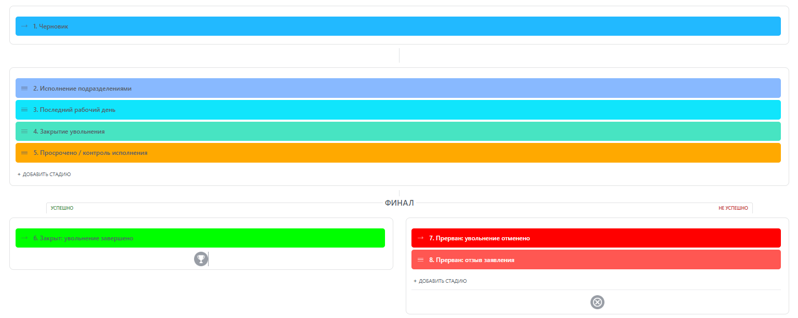

Этапы идут так:

- **Черновик** — карточку только создали, процесс ещё не запущен. Фиксируем причину, даты,
- **Исполнение подразделениями** — отключаем доступы, забираем технику, закрываем пропуска
- **Последний рабочий день** — прощаемся, рассчитываемся, отдаём документы
- **Закрытие увольнения** — финальная сверка перед закрытием карточки
- **Просрочено / контроль исполнения** — дополнительная проверка всех моментов увольнения

  

А дальше — развилка. Финалов у процесса четыре: один успешный (**«Закрыт: увольнение завершено»**) и три прерывающих — **«Прерван: увольнение отменено»**, **«Прерван: отзыв заявления»** 

:::info
На этапе «Черновике» карточка просто ждёт, пока вы заполните все обязательные поля. Как только вы переведёте её на «Исполнение подразделениями», процесс начнёт ставить задачи по-настоящему.
:::

# Где найти процесс и как создать карточку

Карточка увольнения всегда создаётся на основе уже существующего профиля сотрудника — отдельно завести увольнение нельзя, сотрудник должен быть в системе.

**Шаг 1.** В левом меню находим раздел **HR**. Внутри — три подраздела: **Профиль сотрудника**, **Адаптация** и **Увольнение**.

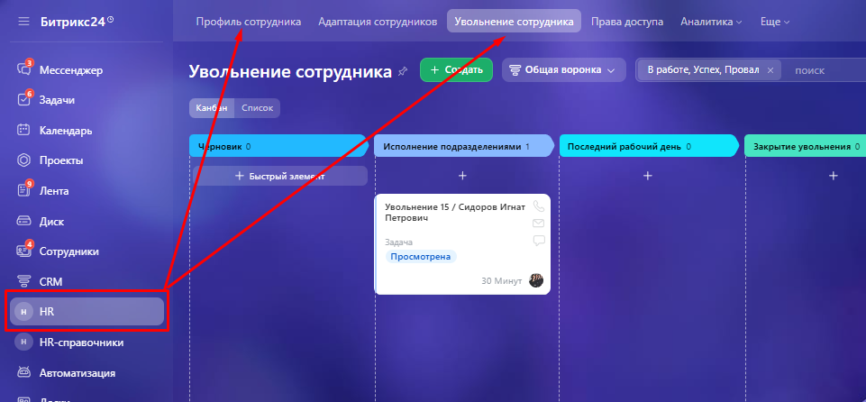

**Шаг 2.** Если сотрудника ещё нет в системе, сначала заводим его в **Профиле сотрудника** — заполняем ФИО, должность, подразделение и отмечаем, что ему выдавали при найме: почту, пропуск, технику, форму, место в кампусе. Эти же галочки понадобятся при увольнении.

**Шаг 3.** Переходим в подраздел **Увольнение** и нажимаем зелёную кнопку **«Создать»**.

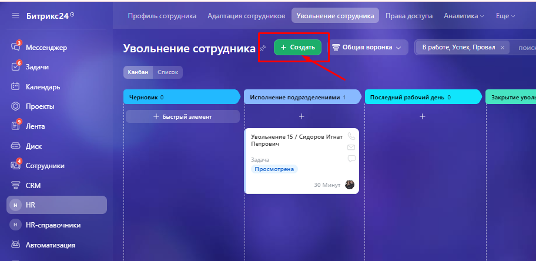

**Шаг 4.** В открывшейся форме выбираем нужного сотрудника из списка профилей. ФИО, должность и подразделение подставятся сами.

:::info
Если переименовать профиль сотрудника уже после создания карточки увольнения, название карточки не обновится само — вернитесь и поправьте его вручную, чтобы не путаться в списке.
:::

## Какие поля важно заполнить

Дальше нужно заполнить несколько полей — от них зависит, какие задачи получит каждый участник и в какие сроки.

•      **Основание увольнения** — по инициативе работодателя, по инициативе сотрудника, не пройден испытательный срок или иное.

•      **Причина увольнения** — это поле закрытое: его видят только HR-директор, руководитель по кадровой работе, непосредственный руководитель сотрудника и ещё пара ролей. Остальным сотрудникам оно не показывается.

•      **Непосредственный и вышестоящий руководитель** — подтягиваются из профиля, но их можно поменять.

•      **Даты** — дата заявления, планируемая дата увольнения и последний рабочий день. Именно от них процесс отсчитывает сроки всех задач.

•      **Уволить одним днём** — переключатель для срочных увольнений (подробнее — ниже).

•      **Трудовая книжка** — электронная или бумажная. От этого зависит, появится ли в последний день задача выдать бумажный бланк.

:::info
Галочка «Уволить одним днём» нужна, когда между решением и последним рабочим днём — считаные часы. Она ставит срок всех задач сразу на дату увольнения, 15:00, вместо того чтобы растягивать их на несколько дней вперёд.
:::

# Сохраняем карточку и запускаем работу подразделений

После сохранения система сообщает, что процедура увольнения запущена, но по-настоящему задачи ещё не поставлены — карточка стоит на «Подготовке». Чтобы включить работу смежных отделов, переведите карточку на этап **«Исполнение подразделениями»** вручную, перетащив её на канбане.

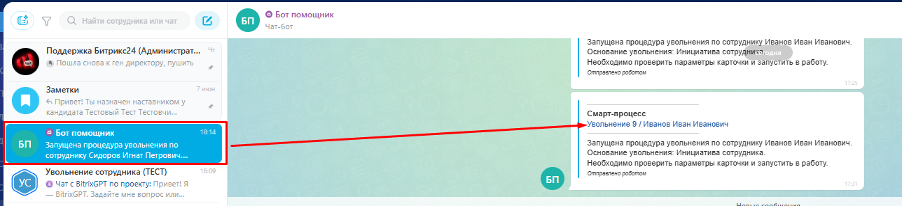

Как только это произойдёт, система за один раз создаёт весь пакет задач — часть из них ляжет на сроки за несколько дней до увольнения, часть — точно на последний рабочий день.

:::info
Все задачи процесса попадают в общий проект «Увольнение сотрудников» в разделе «Задачи и проекты». Если задач много и нужно найти именно свои, добавьте в настройках списка колонку «Элемент CRM» — тогда будет видно, к какой карточке увольнения относится каждая задача. Или просто ищите по фамилии сотрудника.
:::

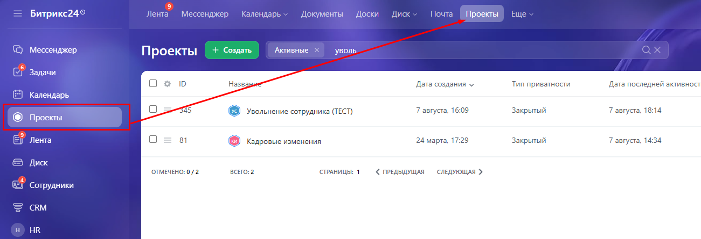

# Где вы будете работать: карточка, задачи и автоматизация

Логика та же, что и в адаптации, — работа идёт в трёх местах.

•      **Карточка увольнения** — общая картина по сотруднику: какие задачи закрыты, какие в работе, какие просрочены. Сюда заглядывает в основном тот, кто контролирует процесс.

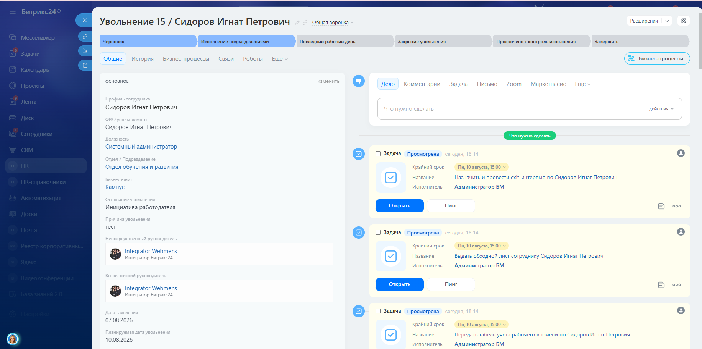

•      **Задачи и проекты** — рабочий список для исполнителей: кадровика, айтишника, бухгалтера, коменданта кампуса. Каждый закрывает свои задачи там же, где и остальные.

•      **Автоматизация** — шаги, где нужно принять решение, а не просто отчитаться о выполнении. Например, запрос «Проверьте полноту закрытия» приходит именно сюда, в раздел «Автоматизация», и открывается кнопкой «Приступить».

:::info
О задаче сообщает колокольчик, о шаге автоматизации — бот-помощник в чате со ссылкой на процесс. Красный счётчик у пункта меню — общий сигнал «здесь есть что сделать».
:::

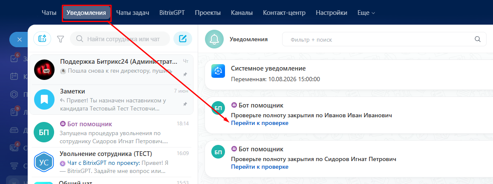

&nbsp;

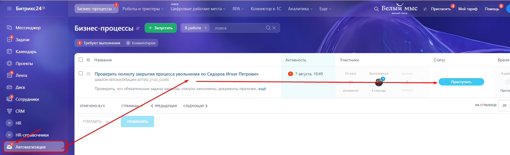

# Подробно про этапы процесса

## Подготовка к увольнению: первые задачи по кадрам и бухгалтерии

Как только карточка переходит на этот этап, система параллельно ставит первую партию задач — большинство со сроком за 2–3 дня до даты увольнения:

•      подготовить и выдать сотруднику обходной лист;

•      передать в бухгалтерию табель учёта рабочего времени за отработанный период;

•      если у сотрудника было заселение в кампус — передать данные для расчёта за проживание;

•      ознакомить руководителя отдела подбора и адаптации с причиной увольнения — чтобы вовремя заметить риски по другим сотрудникам;

•      организовать передачу дел, информации и доступов преемнику или руководителю;

•      подготовить окончательный расчёт и пакет справок;

•      если было заселение в кампус — согласовать дату выселения;

•      назначить exit-интервью, если оно предусмотрено.

:::info
Часть этих задач условна и появляется только «под конкретного человека». Если при найме сотруднику не оформляли место в кампусе, задачи на выселение просто не будет — система смотрит на те же галочки, что были заполнены в профиле.
:::

## Исполнение подразделениями: закрываем доступы и забираем активы

Здесь процесс отрабатывает техническую сторону увольнения — всё то, что нужно отключить и забрать, зеркально тому, что выдавалось при выходе на работу.

•      аннулировать физический пропуск на территорию, если он был выдан;

•      аннулировать пропуск в кампус и обновить списки, если было заселение;

•      отключить доступ в SkillCup;

•      отключить доступ в Битрикс24;

•      отключить доступы в остальные информационные системы компании;

•      принять от сотрудника технику и зафиксировать возврат;

•      удалить сотрудника из рабочих чатов «Команда» и «Офис»;

•      заблокировать корпоративную почту и убрать сотрудника из сводных таблиц;

•      удалить из программы ДМС, если она была подключена;

•      провести exit-интервью, если оно было назначено на предыдущем этапе.

:::info
Удобство в том же, что и при отмене адаптации: не нужно вспоминать, что именно выдавали сотруднику два года назад. Процесс сверяется с теми же полями, что при найме, и отключает ровно то, что действительно было включено.
:::

## Если дата увольнения меняется

Планы срываются: сотрудник просит отработать ещё неделю или, наоборот, уходит раньше. Откатывать всё вручную не нужно.

**Шаг 1.** В карточке увольнения открываем **«Бизнес-процессы»** и запускаем **«Изменение даты увольнения»**.

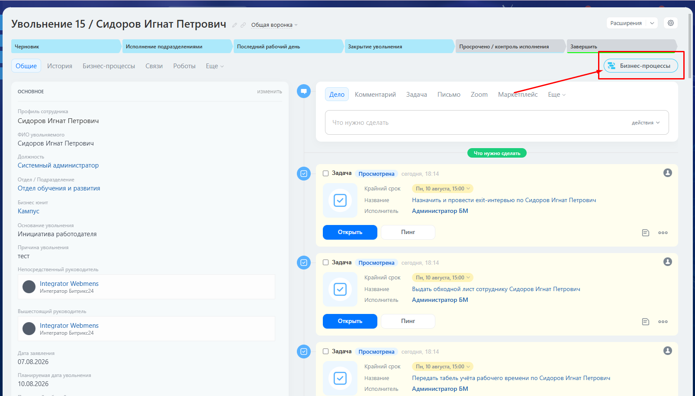

**Шаг 2.** Указываем новую дату и нажимаем **«Запустить»**.

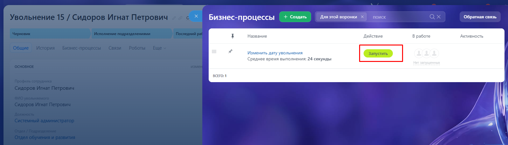

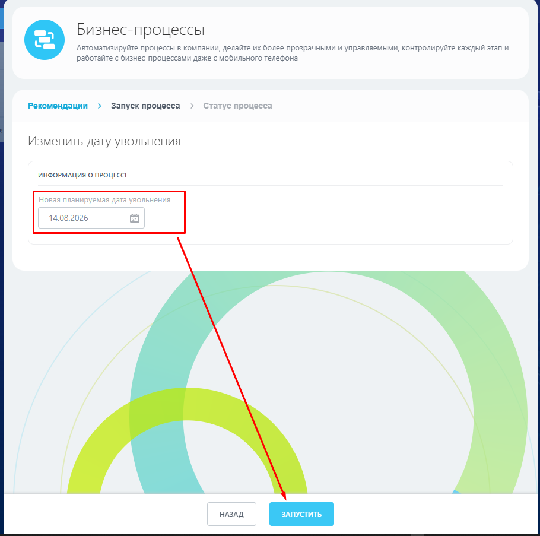

**Шаг 3.** Система пересчитывает сроки у всех задач, завязанных на дату увольнения. Это занимает не мгновение, а секунд 30 — обновите страницу чуть позже, чтобы увидеть новые сроки.

:::info
Если часть задач вы уже закрыли, а дата увольнения потом сдвинулась — система вернёт такие задачи в работу заново. Это осознанное поведение: раз дата изменилась, то, что было рассчитано на старую дату, нужно перепроверить.
:::

## Последний рабочий день: прощаемся и рассчитываемся

В день, указанный в карточке, процесс сам добавляет финальную порцию задач — она устроена вокруг того, чтобы ничего не забыть в последние часы.

•      руководитель принимает материальные ценности, форму, ключи и другие активы, подписывает обходной лист;

•      отдел кадров знакомит сотрудника с приказом об увольнении и выдаёт справки;

•      если трудовая книжка бумажная — её выдают на руки в этот же день;

•      кадры забирают физический пропуск и отмечают выполнение обходного листа (а если пропуск потерян — делают отметку об утере);

•      бухгалтерия производит окончательный расчёт и готовит справки;

•      обходной лист передаётся сотруднику лично бухгалтером по зарплате и возвращается в отдел кадров.

## Закрытие увольнения: финальная сверка

На следующий рабочий день после последнего дня сотрудника система ставит контрольную задачу руководителю по кадровой работе — **«Проверить полноту закрытия процесса»**. Нужно свериться, что все обязательные задачи закрыты, документы приложены, а результат по каждой зафиксирован.

Дальше — шаг автоматизации с двумя вариантами ответа:

•      **Всё закрыто** — карточка переходит в финал **«Закрыт: увольнение завершено»**.

•      **Есть замечания** — карточка уходит в статус **«Просрочено / контроль исполнения»**, и системой ставится задача «Проконтролировать устранение замечаний по увольнению». Как только замечания устранены, задачу закрывают, а карточку в финал переводят уже вручную.

:::info
Пока в карточке остаётся хотя бы одна незакрытая обязательная задача, завершить процесс не получится — это встроенное правило, а не забывчивость системы.
:::

# Если увольнение не состоялось: прерывание процесса

Иногда решение отменяют или сотрудник отзывает заявление. Перезаводить карточку заново не нужно.

**Шаг 1.** На любом этапе нажимаем **«Завершить»**.

**Шаг 2.** Выбираем нужный вариант прерывания: **«Прерван: увольнение отменено»** или **«Прерван: отзыв заявления»** — и указываем причину.

**Шаг 3.** Нажимаем **«Сохранить»**.

Все задачи, которые ещё не были закрыты, система завершает автоматически — исполнителям не придётся тратить время на то, что уже неактуально.

# Особый случай: увольнение одним днём

Если решение принято и последний день — сегодня или завтра, отмечаем в карточке **«Уволить одним днём» = Да**. Все задачи процесса, вне зависимости от того, на какой день они обычно рассчитаны, встанут на дату увольнения с крайним сроком 15:00. Это удобно, когда растягивать процесс на несколько дней просто некогда.

# Что дальше

Мы разобрали полный путь карточки увольнения — от создания до закрытия. Если сотрудник не проходит испытательный срок, процесс увольнения запускается автоматически из «Адаптации» — об этой связке и о разделе «Профиль сотрудника» расскажу отдельно.